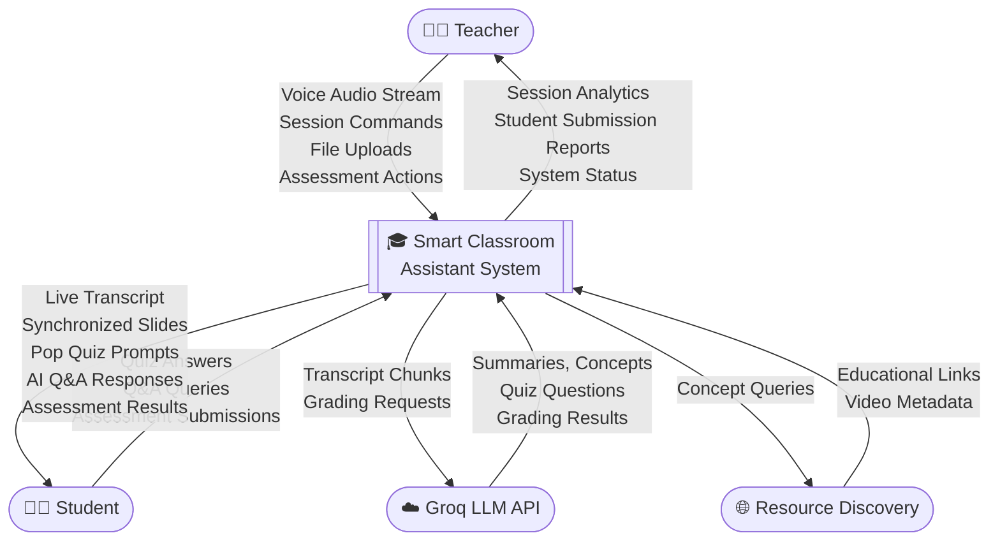
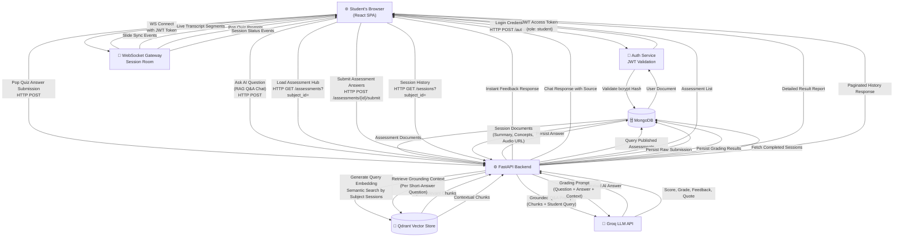
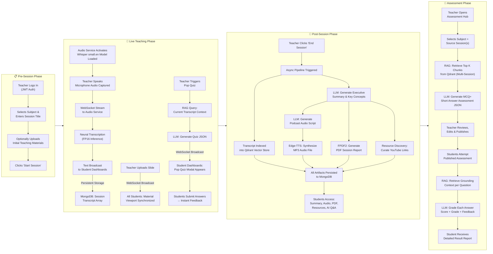

# Chapter 5: Project Description

---

## 5.1 Problem Definition

The contemporary educational environment presents a fundamental and persistent challenge: the significant cognitive gap between the delivery of verbal instruction and the effective capture, retention, and retrieval of that knowledge by students. A typical academic lecture is an information-dense, time-constrained event wherein the educator delivers complex material at a pace that invariably outstrips a student's capacity to simultaneously comprehend, process, and transcribe it.

Research in educational psychology consistently demonstrates that attempting to take detailed notes while concurrently listening and understanding is a form of dual-task interference — a phenomenon where two cognitively demanding tasks compete for the same limited attentional resources, resulting in diminished performance on both. The consequence is a substantial and systematic loss of lecture content, where students capture an estimated 40–60% of verbally delivered information on average.

Beyond the student-side challenge, educators face an equally complex operational problem: they have no real-time, scalable mechanism to assess comprehension during instruction, no automated tools to generate study materials post-lecture, and no structured way to connect lecture content to supplementary learning resources in a time-efficient manner.

**The foundational problem can be stated as follows**: there exists a critical, structural disconnect between the richness of live spoken instruction and the poverty of the tools available to capture, process, distribute, and interactively leverage that instruction for the advancement of student learning outcomes.

---

## 5.2 Project Overview

The **Smart Classroom Assistant** is a comprehensive, AI-integrated pedagogical platform designed to serve as an intelligent cognitive layer over the physical classroom. It augments — rather than replaces — the educator's role by automating the laborious, mechanical aspects of knowledge capture and content generation, thereby freeing both teacher and student to focus on the higher-order dimensions of learning: understanding, discussion, and application.

The platform is built around six core functional pillars:

1. **Real-Time Neural Transcription**: A locally deployed Whisper `small.en` neural model continuously converts the teacher's speech into text with sub-second latency, streaming the results to all connected student dashboards simultaneously.

2. **AI-Driven Session Summarization**: Upon session conclusion, a Large Language Model (LLM) pipeline automatically produces a multi-format pedagogical artifact suite from the session transcript — including executive summaries, key concept extractions, session classification, and podcast-style audio overviews.

3. **RAG-Powered Assessment Hub**: A Retrieval-Augmented Generation engine indexes session transcripts and uploaded materials into a semantic vector store, enabling the generation of context-grounded quiz assessments and AI-assisted student answer grading.

4. **WebSocket-Driven Real-Time Synchronization**: A persistent WebSocket gateway maintains low-latency bidirectional channels between the teacher's control interface and all student clients, enabling instantaneous propagation of slide updates, quiz broadcasts, and transcript increments.

5. **Intelligent Resource Recommendation**: Key concepts automatically extracted from completed sessions are used to discover and curate relevant external educational resources, delivered directly to the student interface.

6. **Role-Based Interactive Dashboards**: Dedicated, purpose-built interfaces for Teachers (session control, material management, assessment dispatch, analytics) and Students (live transcript, synchronized materials, quiz participation, AI Q&A, resource discovery) provide a streamlined experience tailored to each user's workflow.

---

## 5.3 Detailed Feature Description

### 5.3.1 Real-Time Transcription and Live Captioning

The transcription pipeline is one of the system's most technically demanding features. When a teacher initiates a session, the browser captures the microphone audio stream and begins transmitting 16kHz mono PCM audio frames to the Audio Service via WebSocket. The Whisper `small.en` model processes accumulated audio buffers continuously.

Transcribed text segments are:
- **Broadcast instantly** to all students in the session room via the main application's WebSocket gateway.
- **Persistently stored** as an ordered array of `{text, timestamp}` objects within the session document in MongoDB.
- **Displayed in real-time** on the student dashboard in a smooth-scrolling transcript viewer.

The transcript stream also feeds the RAG indexing pipeline: upon session finalization, the complete transcript is chunked, embedded, and stored in the Qdrant vector store for subsequent assessment generation and AI Q&A.

### 5.3.2 Post-Session AI Summarization Pipeline

At the conclusion of a session — triggered by the teacher clicking "End Session" — an asynchronous processing pipeline is initiated. This pipeline orchestrates several LLM tasks in sequence:

| Stage | Task | LLM Output |
|:---|:---|:---|
| **1** | Executive Summary Generation | A concise, multi-paragraph summary of the session's core narrative. |
| **2** | Key Concept Extraction | A curated list of the most important academic concepts discussed. |
| **3** | Session Type Classification | Categorical label (e.g., `"Lecture"`, `"Lab"`, `"Workshop"`, `"Seminar"`). |
| **4** | Difficulty Level Estimation | Estimation of the session's overall academic complexity level. |
| **5** | Podcast Script Generation | A narrative, conversational audio script derived from the summary. |
| **6** | Text-to-Speech Synthesis | Podcast audio generated using `edge-tts` with an Indian English female voice profile. |
| **7** | PDF Report Generation | A professionally formatted PDF document containing the full report using FPDF2. |
| **8** | Resource Discovery | Extracted concepts are used to search for and curate YouTube video recommendations. |

All generated artifacts are persisted to the session's MongoDB document and made available to students through the session history interface.

### 5.3.3 RAG-Powered Assessment Hub

The Assessment Hub is a persistent, subject-scoped assessment management system accessible from both the teacher's and student's dashboards.

**Teacher Workflow:**
1. The teacher navigates to the Assessment Hub, selects a subject, and optionally selects one or more past session transcripts as source material.
2. The teacher triggers the "Generate with AI" function.
3. The RAG pipeline retrieves the most semantically relevant content from the selected sessions' indexed vectors.
4. The LLM generates a structured assessment containing a mix of MCQ and short-answer questions, each grounded in the retrieved lecture content.
5. The teacher can review, edit individual questions, and save the assessment.
6. The teacher publishes the assessment, making it visible to enrolled students.

**Student Workflow:**
1. The student navigates to the Assessment Hub and sees all published assessments for their enrolled subjects.
2. The student selects an assessment and provides answers to all questions — selecting options for MCQs and typing responses for short-answer questions.
3. Upon submission, the AI grading pipeline is invoked: each short-answer response is evaluated against the RAG-retrieved grounding context, producing a score, grade letter, personalized narrative feedback, and a `teacher_quote` for reinforcement.
4. MCQ answers are graded automatically based on the `correct_index` stored in the assessment document.
5. The student receives an immediate, detailed result report with their overall score, percentage, and per-question feedback.

### 5.3.4 Interactive Pop Quiz System

During a live session, the teacher can instantly trigger a **Pop Quiz** — a spontaneous, in-session assessment broadcast to all connected students. Unlike the persistent Assessment Hub quizzes, pop quizzes are ephemeral and designed for immediate comprehension checks.

- The teacher clicks "Launch Pop Quiz" during an active session.
- The system generates 3–5 questions from the current session's real-time transcript using the LLM.
- A modal appears on all student dashboards simultaneously, prompting immediate engagement.
- Students submit their answers within the session interface.
- Results are displayed and are accessible for review by both the teacher and students.

### 5.3.5 Teacher Control Dashboard

The Teacher Control Dashboard functions as the session management nerve center. It provides:

- **Session Initiator**: Start a new session by providing a title, subject association, and optionally uploading an initial slide set. The dashboard transitions to the live session view upon confirmation.
- **Transcription Monitor**: A real-time view of the live transcript with per-segment display, allowing the teacher to monitor transcription quality.
- **Material Propagation Engine**: Upload PDFs or images into the live session. The uploaded material is immediately broadcast to all connected student dashboards via WebSocket, and the PDF content is simultaneously indexed into the Qdrant vector store for future RAG retrieval.
- **Pop Quiz Dispatcher**: A single-click trigger to generate and broadcast an in-session quiz to all students, optionally based on the most recent transcript context.
- **Session History and Analytics**: Review all past sessions for each subject, access generated summaries, download PDF reports, stream podcast audio overviews, and view per-session resource recommendations.
- **Assessment Hub Management**: Create, publish, edit, and delete subject-scoped assessments; browse student submissions and grading results.

### 5.3.6 Student Learning Dashboard

The Student Learning Dashboard is designed to be a non-intrusive, information-rich learning companion:

- **Live Transcript Viewer**: A fluid, auto-scrolling panel that displays the real-time transcription stream from the teacher's session.
- **Synchronized Material Viewer**: Displays whichever slide or PDF the teacher has currently shared, automatically updating in sync with the teacher's actions via WebSocket.
- **Session History Access**: Browse all completed sessions for enrolled subjects, access summaries, download study materials, and stream audio overviews.
- **AI Classroom Assistant (RAG Q&A Chatbot)**: An interactive chat interface where students can pose subject-specific questions. The chatbot retrieves the most semantically relevant chunks from indexed sessions and materials and formulates a contextually grounded answer.
- **Assessment Hub Access**: View, attempt, and receive immediate AI-graded feedback on published assessments.
- **Resource Recommendations**: Browse curated external learning resources linked to specific concepts from completed sessions.
- **Pop Quiz Participation**: Respond to teacher-initiated in-session pop quizzes via a non-disruptive modal overlay.

---

## 5.4 System Architecture Overview

The Smart Classroom Assistant is implemented as a decoupled, service-oriented system comprising four distinct runtime components:

```
┌─────────────────────────────────────────────────────────────────┐
│                         CLIENT LAYER                            │
│  ┌──────────────────────────┐  ┌──────────────────────────────┐ │
│  │   Teacher's Browser      │  │   Student's Browser(s)       │ │
│  │   React SPA (Vite)       │  │   React SPA (Vite)           │ │
│  │   - Session Control UI   │  │   - Live Transcript UI       │ │
│  │   - Material Upload      │  │   - Material Viewer          │ │
│  │   - Assessment Hub       │  │   - Assessment Hub           │ │
│  └──────────┬───────────────┘  └──────────────┬───────────────┘ │
└─────────────│──────────────────────────────────│────────────────┘
              │  HTTP REST / WebSocket           │  WebSocket
              │                                  │
┌─────────────▼──────────────────────────────────▼────────────────┐
│                     APPLICATION LAYER                           │
│            FastAPI Backend (Uvicorn ASGI, Port 8001)            │
│  - REST API Endpoints (Auth, Sessions, Assessments, Materials)  │
│  - WebSocket Gateway (Transcript Broadcast, Slide Sync, Quizzes)│
│  - AI Orchestration (Summarizer, Resource Discovery)            │
│  - RAG Assessment Engine (Vector Retrieval + LLM Grading)       │
└──────┬──────────────────────────────────────────────────┬───────┘
       │  Internal WebSocket / HTTP                       │
       │                                                  │
┌──────▼───────────┐                          ┌──────────▼────────┐
│   AUDIO SERVICE  │                          │     DATA LAYER    │
│  (Port 8765)     │                          │                   │
│  Faster-Whisper  │                          │  MongoDB (Primary)│
│  Whisper small.en│                          │  Qdrant (Vectors) │
│  VAD Filter      │                          │  File Storage     │
│  Audio Segmenter │                          │  (PDFs, Audio)    │
└──────────────────┘                          └───────────────────┘
```

---

## 5.5 Data Flow Diagrams

### 5.5.1 System-Level Data Flow Diagram (Level 0 — Context Diagram)



---

### 5.5.2 Teacher Perspective — Data Flow Diagram

```mermaid
flowchart TD
    T_MIC["🎤 Teacher Microphone\n(Browser MediaDevices API)"]
    T_DASH["📊 Teacher Control Dashboard\n(React SPA)"]
    AUDIO_SVC["🔊 Audio Service\nWhisper small.en\n(Port 8765)"]
    MAIN_API["⚙️ FastAPI Backend\n(Port 8001)"]
    WS_GW["📡 WebSocket Gateway\nSession Broadcast Room"]
    MONGODB[("🗄️ MongoDB\nPrimary Database")]
    QDRANT[("🔵 Qdrant\nVector Store")]
    LLM["🧠 Groq LLM API\nLlama 3.3 70B"]
    TTS["🔉 Edge-TTS Engine\nAudio Summary Generation"]
    PDF_GEN["📄 FPDF2\nReport Generator"]
    RESOURCE["🔗 Resource Discovery\nYouTube Curation Engine"]
    STUDENT_DASH["📱 Student Dashboards\n(All Connected Clients)"]

    T_MIC -->|"16kHz Mono PCM\nAudio Frames"| AUDIO_SVC
    AUDIO_SVC -->|"Transcribed Text Segments\n(WebSocket)"| MAIN_API
    MAIN_API -->|"Segment Persistence"| MONGODB
    MAIN_API -->|"Broadcast Transcript Increment"| WS_GW
    WS_GW -->|"Real-Time Caption Update"| STUDENT_DASH

    T_DASH -->|"Start/End Session\nHTTP POST"| MAIN_API
    MAIN_API -->|"Create Session Document"| MONGODB

    T_DASH -->|"Upload PDF / Image\n(multipart/form-data)"| MAIN_API
    MAIN_API -->|"Store File & Metadata"| MONGODB
    MAIN_API -->|"Extract & Chunk PDF Text\nGenerate Embeddings"| QDRANT
    MAIN_API -->|"WS: Broadcast Slide Update"| WS_GW
    WS_GW -->|"Synchronized Material View"| STUDENT_DASH

    T_DASH -->|"Trigger Pop Quiz\nHTTP POST"| MAIN_API
    MAIN_API -->|"Semantic Search\nCurrent Transcript Context"| QDRANT
    QDRANT -->|"Relevant Chunks"| MAIN_API
    MAIN_API -->|"Quiz Generation Prompt"| LLM
    LLM -->|"Structured Quiz JSON"| MAIN_API
    MAIN_API -->|"WS: Broadcast Quiz Prompt"| WS_GW
    WS_GW -->|"Pop Quiz Modal"| STUDENT_DASH

    T_DASH -->|"Generate Subject Assessment\nSelect Sessions + Subjects"| MAIN_API
    MAIN_API -->|"Multi-Session RAG Search"| QDRANT
    QDRANT -->|"Top K Relevant Chunks"| MAIN_API
    MAIN_API -->|"Assessment Generation Prompt"| LLM
    LLM -->|"MCQ + Short Answer JSON"| MAIN_API
    MAIN_API -->|"Persist Assessment Document"| MONGODB

    T_DASH -->|"End Session Trigger"| MAIN_API
    MAIN_API -->|"Aggregate Transcript"| MONGODB
    MAIN_API -->|"Index Transcript Chunks"| QDRANT
    MAIN_API -->|"Summarization Prompt"| LLM
    LLM -->|"Summary, Concepts, Session Type"| MAIN_API
    MAIN_API -->|"Generate Podcast Script"| LLM
    LLM -->|"Podcast Narration Script"| MAIN_API
    MAIN_API -->|"Synthesize Audio"| TTS
    TTS -->|"MP3 Audio File"| MAIN_API
    MAIN_API -->|"Generate PDF Report"| PDF_GEN
    PDF_GEN -->|"PDF Artifact"| MAIN_API
    MAIN_API -->|"Query Resource Discovery"| RESOURCE
    RESOURCE -->|"Curated Video Links"| MAIN_API
    MAIN_API -->|"Persist All Artifacts"| MONGODB
    MAIN_API -->|"WS: Notify Completion"| WS_GW
    WS_GW -->|"Session Finalized Alert"| STUDENT_DASH
```



---

### 5.5.3 Student Perspective — Data Flow Diagram



---

### 5.5.4 Overall Project Process Flow Diagram


